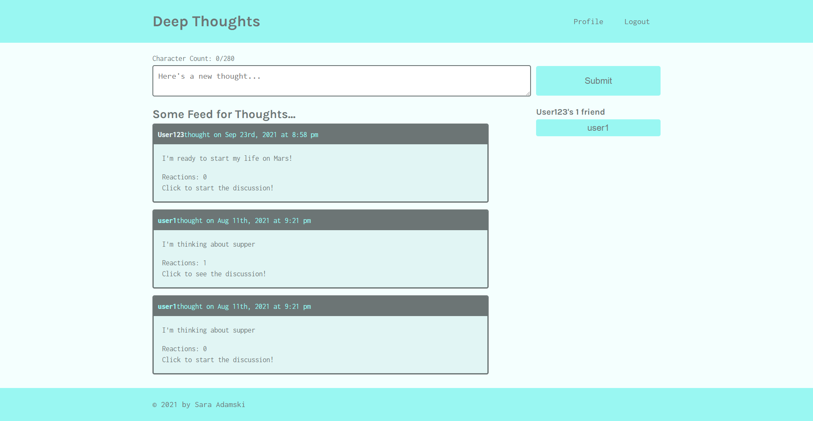

# Deep Thoughts

## Table of Contents
* [Deployed](#deployed)
* [Description](#description)
* [Technologies](#technologies)
* [Usage](#usage)
* [Preview](#preview)
* [Credits](#credits)

## Deployed
Visit the application at https://tranquil-plains-47796.herokuapp.com/

## Description
A social media website where users can post thoughts, comment their reactions, and add friends to keep in touch and stay up to date on other users' lives.

## Technologies
* MongoDB
* Express.js
* React
* Node.js
* GraphQL
* JSON Web Tokens
* Apollo Server
* bCrypt
* Mongoose

## Usage
On the homepage, you can view all posts created by users. To interact with the page, select "Login" to create an account or "Signup" to access an existing one. Make sure your user info is unique!

Once logged in, you will see a textbox that can be used to create a new thought that will be entered into the feed after clicking "Submit."

To view your profile, select "Profile" in the navigation, where you can view your posts and create new ones. Your friend list will appear on the right, or a prompt to make some new friends if you haven't added any yet.

To view other profiles and add friends, click the username on another user's post from the main feed. You can always return to the main feed by selecting the "Deep Thoughts" title in the navigation.

When viewing another user's profile, you will see their posts and a list of their friends. If you are not yet friends, add them by selecting the Add Friend button on the right.

To comment on posts, select "Click to see/start the discussion" at the bottom of a post to be taken to that thought's page. Leave a reaction using the textbox and view other reactions to that thought by other users.

## Preview

## Credits
Sara Adamski